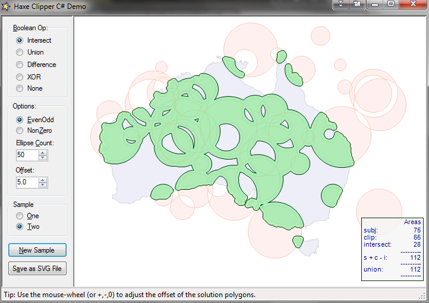

hxClipper
=========

Port of [Angus Johnson's Clipper lib v6.2.9](http://sourceforge.net/projects/polyclipping/) to haxe 3.1+

## Notes

 - Int64 feature has not been ported yet (as it requires an Int128 not currently available in haxe)
 - Tests from the original code have also been ported. They're all passing, except the ones requiring 64bit Ints

<small>Screenshot of [online js demo](https://rawgit.com/azrafe7/hxClipper/master/bin/js/index.html) (using [sui](https://github.com/fponticelli/sui))</small>

<small>Screenshot of C# GuiDemo compiled with VS using haxe generated .NET dll</small>

## License

**hxClipper** is developed by Giuseppe Di Mauro (azrafe7), porting original code from Angus Johnson, and released under the Boost 1.0 license. See the [LICENSE](LICENSE) file for details. 
